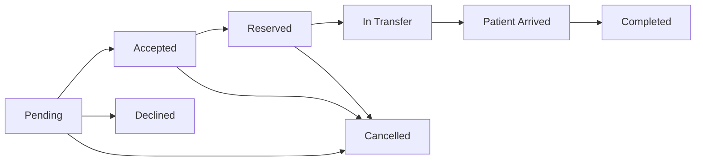

# CareBridge Project Documentation

## 1. Project Overview

CareBridge is a web-based hospital capacity coordination system. It supports hospitals that need to coordinate patient placement when a patient may be rejected, delayed, or redirected because the current hospital has no available capacity.

The system is not meant to replace a full electronic health record system. It is a focused coordination layer for capacity-based transfer decisions between hospitals.

## 2. Problem Statement

Hospitals can become full in general wards, emergency departments, ICU units, or ambulance availability. When this happens, a patient may be rejected or delayed without a shared view of which partner hospital can accept them.

CareBridge addresses this by giving hospitals a shared workflow for:

- Finding available capacity.
- Creating capacity-based transfer requests.
- Accepting, declining, or reserving capacity.
- Monitoring patient delivery.
- Recording actions for review and accountability.

## 3. Project Goals

- Help hospitals coordinate patients who may be rejected due to full capacity.
- Give staff clear role-based workspaces.
- Track the full request lifecycle from creation to completion.
- Reduce manual confusion around bed reservation and status updates.
- Provide coordinators and admins with network-wide visibility.
- Keep a clear audit trail for operational review.

## 4. Use Case Scenario

A patient arrives at a hospital needing urgent care, but the hospital is already full. There are no available beds, and the staff cannot safely admit another patient.

Without CareBridge, the patient or staff may need to look for another hospital manually. This can mean calling different hospitals one by one, waiting for confirmation, repeating the patient's situation, and hoping the available bed information is still accurate. This creates stress, delay, and uncertainty.

With CareBridge, staff can create a request in the system. CareBridge shows which hospital can accept the patient based on available capacity, such as emergency beds, ICU beds, or general beds. The receiving hospital can accept, decline, or reserve the needed capacity directly in the system.

Because of this, the hassle of manually searching for another hospital is reduced. The patient does not have to keep looking for an available hospital, and staff can quickly coordinate with a hospital that has space.

## 5. Target Users

### Sending Staff

Sending staff work from the hospital that needs help placing a patient. Their primary job is to create transfer requests, choose a receiving hospital, provide patient reference details, and start the transfer once capacity is reserved.

### Receiving Staff

Receiving staff work from the hospital that may accept a patient. Their primary job is to update their own hospital capacity, triage incoming requests, accept or decline requests, reserve capacity, mark arrivals, and complete transfers.

### Coordinator

Coordinators monitor activity across hospitals. They do not replace hospital staff decisions, but they can watch network pressure, use the command view, escalate active requests, add coordinator notes, and review analytics.

### Admin

Admins manage system records. They can create and update users, hospitals, system settings, demo data, audit logs, analytics, and the command view.

## 6. What Makes CareBridge Different

CareBridge is built around capacity rejection, not elective hospital transfer.

Traditional hospital systems often focus on internal patient records. CareBridge focuses on the moment when a hospital is full and a person needs another hospital that can accept them safely. The system helps staff decide where the patient can go, what capacity is available, what status the request is in, and who performed each action.

## 7. System Modules

### Public Pages

- Landing page
- Login
- Sign up
- Forgot password
- Reset password
- Dark mode toggle

### Authenticated Pages

- Dashboard
- Hospital Capacity
- Create Transfer
- Incoming Requests
- Transfer Tracking
- Transfer Detail
- Command View
- Hospital Directory
- Analytics
- Admin Management
- Audit Logs
- Settings

## 8. Feature List

### Authentication

- Token-based login with Laravel Sanctum.
- Public registration for hospital staff roles.
- Forgot password token generation.
- Reset password flow.
- Profile settings update.
- Role-specific settings and descriptions.

### Hospital Capacity

Capacity is tracked per hospital with:

- General beds available.
- Emergency beds available.
- ICU beds available.
- Ambulances available.
- Last updated timestamp.

Receiving staff can update only their own hospital capacity.

### Transfer Requests

A transfer request contains:

- Sending hospital.
- Receiving hospital.
- Patient reference code.
- Case type.
- Urgency level.
- Notes.
- Rejection reason.
- Placement need.
- Document readiness.
- Status.
- Delivery status.
- Transport details.
- Accept conditions.
- Reservation expiry.
- Handoff notes.
- Coordinator notes.

### Hospital Recommendations

Sending staff can view suggested receiving hospitals. Recommendations are ranked based on matching capacity for the selected case type:

- General case uses general beds.
- Emergency case uses emergency beds.
- ICU case uses ICU beds.

### Incoming Request Triage

Receiving staff can see incoming requests for their hospital. Requests are sorted by urgency and waiting time. They can:

- Accept with conditions.
- Decline with a reason.
- Reserve capacity after accepting.
- View request details.

### Delivery Monitoring

The delivery workflow tracks:

- Transfer started time.
- Patient arrival time.
- Delivery completed time.
- Current or last known location.
- Delivery notes.
- Transport team.
- Ambulance or unit identifier.
- Transport contact.
- Estimated arrival time.

### Coordinator Command View

The command view groups active requests by status:

- Pending
- Accepted
- Reserved
- In transfer
- Completed
- Declined

It also shows:

- Active count.
- Critical count.
- Moving count.
- Escalation dashboard.
- SLA timers.
- Network pressure.
- Hospitals under pressure.
- Reroute suggestions.

### Admin Management

Admins can:

- Create users.
- Update users.
- Create hospitals.
- Update hospitals.
- Manage hospital contact information.
- Manage system settings.
- Refresh demo data.
- View audit logs.

### Audit Logs

Audit logs record operational actions such as:

- Created
- Accepted
- Declined
- Reserved
- In transfer
- Patient arrived
- Completed
- Cancelled
- Escalated
- Coordinator note

Audit logs can be filtered by:

- Action
- User role
- Search text
- Date range

### Analytics

Analytics include:

- Status distribution.
- Urgency distribution.
- Case type distribution.
- Completion rate.
- Total request count.
- Completed request count.
- Recent transfer trends.

### Dark Mode

Dark mode is available across:

- Landing page.
- Authentication pages.
- Dashboard and all authenticated pages.
- Forms, cards, tables, badges, filters, and menus.

The selected theme is stored in local storage.

## 9. Roles and Permissions

| Capability | Sending Staff | Receiving Staff | Coordinator | Admin |
| --- | --- | --- | --- | --- |
| Create transfer request | Yes | No | No | No |
| View own hospital-related transfers | Yes | Yes | Yes | Yes |
| View all transfers | No | No | Yes | Yes |
| Update own hospital capacity | No | Yes | No | No |
| Accept incoming request | No | Yes | No | No |
| Decline incoming request | No | Yes | No | No |
| Reserve capacity | No | Yes | No | No |
| Start transfer | Yes | No | No | No |
| Mark patient arrived | No | Yes | No | No |
| Complete transfer | No | Yes | No | No |
| Cancel own outgoing request | Yes | No | No | No |
| Escalate transfer | No | No | Yes | Yes |
| Add coordinator notes | No | No | Yes | Yes |
| View command board | No | No | Yes | Yes |
| View analytics | No | No | Yes | Yes |
| Manage users and hospitals | No | No | No | Yes |
| View audit logs | No | No | No | Yes |
| Update system settings | No | No | No | Yes |

## 10. Transfer Status Lifecycle



## 11. Delivery Status Lifecycle


## 12. Main Data Tables

### hospitals

Stores hospital records.

Important fields:

- `id`
- `name`
- `address`
- `contact_number`
- `transfer_contact_name`
- `transfer_contact_phone`
- `emergency_contact_name`
- `emergency_contact_phone`
- `status`

### users

Stores system users and their assigned role.

Important fields:

- `id`
- `name`
- `email`
- `password`
- `role`
- `hospital_id`

Roles:

- `sending_staff`
- `receiving_staff`
- `coordinator`
- `admin`

### hospital_capacities

Stores capacity records.

Important fields:

- `hospital_id`
- `general_beds_available`
- `emergency_beds_available`
- `icu_beds_available`
- `ambulance_available`
- `last_updated`

### transfer_requests

Stores transfer workflow records.

Important fields:

- `sending_hospital_id`
- `receiving_hospital_id`
- `patient_reference_code`
- `case_type`
- `urgency_level`
- `notes`
- `rejection_reason`
- `placement_need`
- `documents_ready`
- `status`
- `delivery_status`
- `delivery_started_at`
- `patient_arrived_at`
- `delivery_completed_at`
- `delivery_last_location`
- `delivery_notes`
- `transport_team`
- `ambulance_unit`
- `transport_contact`
- `estimated_arrival_at`
- `decline_reason_category`
- `is_escalated`
- `escalated_by`
- `escalated_at`
- `escalation_reason`
- `created_by`
- `accepted_by`
- `accept_conditions`
- `reserved_until`
- `handoff_notes`
- `coordinator_notes`

### transfer_logs

Stores action history for transfer requests.

Important fields:

- `transfer_request_id`
- `user_id`
- `action`
- `remarks`
- `created_at`

### system_settings

Stores configurable operational settings.

Important fields:

- `key`
- `value`

## 13. API Summary

### Public Authentication

| Method | Endpoint | Purpose |
| --- | --- | --- |
| POST | `/api/auth/login` | Login and receive token. |
| GET | `/api/auth/options` | Load signup hospitals and public roles. |
| POST | `/api/auth/register` | Register a hospital staff account. |
| POST | `/api/auth/forgot-password` | Generate reset token. |
| POST | `/api/auth/reset-password` | Reset password. |

### Protected Authentication

| Method | Endpoint | Purpose |
| --- | --- | --- |
| POST | `/api/auth/logout` | Logout current token. |
| GET | `/api/auth/me` | Get current user. |
| GET | `/api/auth/settings` | Get profile and role settings. |
| PUT | `/api/auth/settings` | Update profile settings. |

### Hospitals and Capacity

| Method | Endpoint | Purpose |
| --- | --- | --- |
| GET | `/api/hospitals` | List active hospitals. |
| GET | `/api/hospitals/{id}` | Show hospital details. |
| GET | `/api/hospitals/{id}/capacity` | Show hospital capacity. |
| PUT | `/api/hospitals/{id}/capacity` | Update hospital capacity. |

### Transfer Requests

| Method | Endpoint | Purpose |
| --- | --- | --- |
| GET | `/api/transfer-requests` | List accessible transfers. |
| GET | `/api/transfer-recommendations` | Get ranked receiving hospital suggestions. |
| POST | `/api/transfer-requests` | Create transfer request. |
| GET | `/api/transfer-board` | Get command board data. |
| GET | `/api/transfer-requests/{id}` | Show transfer details. |
| GET | `/api/incoming-requests` | List incoming requests for receiving staff. |
| GET | `/api/transfer-tracking` | List transfer tracking data. |

### Transfer Actions

| Method | Endpoint | Purpose |
| --- | --- | --- |
| PUT | `/api/transfer-requests/{id}/accept` | Accept pending request. |
| PUT | `/api/transfer-requests/{id}/decline` | Decline pending request. |
| PUT | `/api/transfer-requests/{id}/reserve` | Reserve capacity. |
| PUT | `/api/transfer-requests/{id}/transfer` | Start transfer. |
| PUT | `/api/transfer-requests/{id}/arrive` | Mark patient arrived. |
| PUT | `/api/transfer-requests/{id}/complete` | Complete transfer. |
| PUT | `/api/transfer-requests/{id}/cancel` | Cancel request. |
| PUT | `/api/transfer-requests/{id}/escalate` | Escalate active request. |
| PUT | `/api/transfer-requests/{id}/coordinator-notes` | Update coordinator notes. |

### Analytics, Notifications, and Admin

| Method | Endpoint | Purpose |
| --- | --- | --- |
| GET | `/api/dashboard` | Dashboard metrics. |
| GET | `/api/analytics` | Analytics data. |
| GET | `/api/notifications` | Recent activity alerts. |
| GET | `/api/admin` | Admin users and hospitals. |
| POST | `/api/admin/users` | Create user. |
| PUT | `/api/admin/users/{id}` | Update user. |
| POST | `/api/admin/hospitals` | Create hospital. |
| PUT | `/api/admin/hospitals/{id}` | Update hospital. |
| GET | `/api/admin/system-settings` | View settings. |
| PUT | `/api/admin/system-settings` | Update settings. |
| POST | `/api/admin/demo-refresh` | Refresh demo data. |
| GET | `/api/audit-logs` | View filtered audit logs. |

## 14. Frontend Structure

Important frontend directories:

```text
resources/js/src
resources/js/src/api
resources/js/src/components
resources/js/src/pages
resources/js/src/utils
resources/css
```

Important pages:

- `Landing.jsx`
- `Login.jsx`
- `SignUp.jsx`
- `Dashboard.jsx`
- `CreateTransfer.jsx`
- `IncomingRequests.jsx`
- `TransferTracking.jsx`
- `TransferDetail.jsx`
- `CoordinatorBoard.jsx`
- `HospitalDirectory.jsx`
- `Analytics.jsx`
- `AdminManagement.jsx`
- `AuditLogs.jsx`
- `Settings.jsx`

Important components:

- `Layout.jsx`
- `ProtectedRoute.jsx`
- `StatusBadge.jsx`
- `StatCard.jsx`
- `ThemeToggle.jsx`

## 15. Backend Structure

Important backend directories:

```text
app/Http/Controllers/Api
app/Models
database/migrations
database/seeders
routes
tests
```

Important controllers:

- `AuthController`
- `DashboardController`
- `HospitalController`
- `HospitalCapacityController`
- `TransferRequestController`
- `IncomingRequestController`
- `AnalyticsController`
- `NotificationController`
- `AdminController`
- `AuditLogController`

Important models:

- `User`
- `Hospital`
- `HospitalCapacity`
- `TransferRequest`
- `TransferLog`
- `SystemSetting`

## 16. Local Installation

### Requirements

- PHP 8.2 or newer
- Composer
- Node.js and npm
- SQLite, MySQL, or another Laravel-supported database

### Setup Commands

```bash
composer install
cp .env.example .env
php artisan key:generate
php artisan migrate --seed
npm install
npm run build
php artisan serve
```

### Local URL

```text
http://127.0.0.1:8000
```

### Development Mode

```bash
composer run dev
```

or run backend and frontend separately:

```bash
php artisan serve
npm run dev
```

## 17. Demo Data

The seeders create several demo hospital records with different bed and ambulance capacity levels. These records are used for testing hospital capacity, transfer recommendations, incoming requests, and role-based workflows.

Seeded login password:

```text
password123
```

Demo access includes:

- Sending staff account
- Receiving staff account
- Coordinator account
- Admin account

The exact seeded names and emails are defined in `database/seeders/UserSeeder.php`.

## 18. Testing

Run all backend tests:

```bash
php artisan test
```

Run frontend build:

```bash
npm run build
```

Current feature tests cover:

- Authentication settings.
- Public registration restrictions.
- Forgot and reset password flow.
- Transfer request lifecycle.
- Hospital role and capacity permissions.
- Reservation capacity checks.
- Role-specific page restrictions.
- Ranked hospital recommendations.
- Escalation.
- Handoff notes.
- Admin settings.
- Audit filters.

## 19. Security Notes

- Authentication uses Laravel Sanctum tokens.
- `.env` is ignored and should never be committed.
- Public registration is limited to non-privileged hospital staff roles.
- Admin and coordinator routes are checked on the backend.
- Hospital capacity updates are restricted to receiving staff from the same hospital.
- Transfer actions are checked against sending and receiving hospital ownership.

## 20. Known Limitations

- Notifications currently use polling rather than realtime broadcasting.
- There are no browser automation tests yet.
- There is no real SMS, email, or ambulance dispatch integration.
- Password reset tokens are returned for local/demo flow rather than sent by email.
- The system is a coordination tool, not a complete EHR.

## 21. Recommended Future Improvements

- Add realtime notifications with Laravel broadcasting.
- Add browser-level tests for major React workflows.
- Add map-based hospital routing and distance estimates.
- Add file attachment support for handoff documents.
- Add report export for analytics and audit logs.
- Add stricter production password reset email flow.
- Add role approval for public signup requests.
- Add deployment documentation for shared hosting, VPS, or cloud deployment.

## 22. Repository

GitHub repository:

```text
https://github.com/AlekzandarMiguel/carebridge
```
