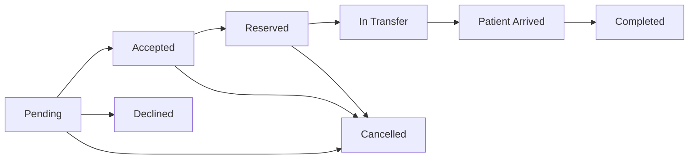

# CareBridge Project Documentation

## 1. Project Overview

CareBridge is a web-based rejected patient placement and delivery coordination system. It works like a focused department for hospitals that need to coordinate patient placement when a patient may be rejected, delayed, or redirected because the current hospital has no available capacity.

The system is not meant to replace a full electronic health record system. It is a focused department-style coordination layer for capacity-based placement and delivery decisions between hospitals.

## 2. Problem Statement

Hospitals can become full in general wards, emergency departments, ICU units, or ambulance availability. When this happens, a patient may be rejected or delayed without a shared view of which partner hospital can accept them.

CareBridge addresses this by giving hospitals a shared department workflow for:

- Finding available capacity.
- Creating rejected patient placement cases.
- Accepting, declining, or reserving capacity.
- Assigning a dispatcher to active cases.
- Maintaining route distance and travel estimates.
- Monitoring patient delivery until handoff.
- Recording delivery timeline events.
- Uploading handoff and supporting documents.
- Prioritizing notifications by urgency, SLA, and ETA state.
- Recording actions for review and accountability.

## 3. Project Goals

- Help hospitals coordinate patients who may be rejected due to full capacity.
- Provide a dedicated placement and delivery department workflow for rejected patients.
- Give staff clear role-based workspaces.
- Separate hospital acceptance decisions from department dispatch monitoring.
- Track the full request lifecycle from creation to completion.
- Reduce manual confusion around bed reservation and status updates.
- Provide coordinators and admins with network-wide visibility.
- Keep a clear audit trail for operational review.
- Preserve supporting documents alongside the case workflow.
- Surface SLA and ETA warnings before delays become invisible.

## 4. Use Case Scenario

A patient arrives at a hospital needing urgent care, but the hospital is already full. There are no available beds, and the staff cannot safely admit another patient.

Without CareBridge, the patient or staff may need to look for another hospital manually. This can mean calling different hospitals one by one, waiting for confirmation, repeating the patient's situation, and hoping the available bed information is still accurate. This creates stress, delay, and uncertainty.

With CareBridge, staff can send the case to the placement department workspace. CareBridge shows which hospital can accept the patient based on available capacity, such as emergency beds, ICU beds, or general beds. The accepting hospital can accept, decline, or reserve the needed capacity directly in the system.

Because of this, the hassle of manually searching for another hospital is reduced. The patient does not have to keep looking for an available hospital, and staff can quickly coordinate with a hospital that has space.

## 5. Target Users

### Intake Staff

Intake staff work from the hospital that needs help placing a rejected patient. Their primary job is to submit rejected patient cases, choose an accepting hospital, provide patient reference details, reroute declined cases, and start delivery once capacity is reserved.

### Acceptance Staff

Acceptance staff work from the hospital that may accept a patient. Their primary job is to update their own hospital capacity, triage acceptance requests, accept or decline cases, reserve capacity, mark arrivals, and complete handoffs.

### Coordinator

Coordinators supervise placement pressure across hospitals. They do not replace hospital staff decisions, but they can watch network pressure, use the command view, escalate active cases, add coordinator notes, and review analytics.

### Dispatcher

Dispatchers work inside the placement and delivery department. Their primary job is to assign active cases, maintain route distance and travel estimates, add delivery timeline updates, and keep delayed delivery movement visible.

### Admin

Admins manage system records. They can create and update users, hospitals, system settings, demo data, audit logs, analytics, and the command view.

## 6. What Makes CareBridge Different

CareBridge is built around a rejected-patient placement department, not elective hospital transfer.

Traditional hospital systems often focus on internal patient records. CareBridge focuses on the moment when a hospital is full and a person needs another hospital that can accept them safely. The system helps staff decide where the patient can go, what capacity is available, what delivery status the case is in, and who performed each action.

## 7. System Modules

### Public Pages

- Landing page
- Login
- Sign up
- Forgot password
- Reset password
- Dark mode toggle

### Authenticated Pages

- Dashboard
- Capacity Desk
- New Rejected Case
- Acceptance Queue
- Delivery Tracking
- Placement and Delivery Detail
- Command View
- Hospital Directory
- Analytics
- Admin Management
- Audit Logs
- Settings

## 8. Feature List

### Authentication

- Token-based login with Laravel Sanctum.
- Public registration for hospital staff roles.
- Admin approval before newly registered accounts can sign in.
- Forgot password token generation and reset email support.
- Reset password flow.
- Profile settings update.
- Role-specific settings and descriptions.

### Hospital Capacity

Capacity is tracked per hospital with:

- General beds available.
- Emergency beds available.
- ICU beds available.
- Ambulances available.
- Last updated timestamp.

Acceptance staff can update only their own hospital capacity.

### Rejected Patient Cases

A rejected patient case contains:

- Sending hospital.
- Receiving hospital.
- Patient reference code.
- Case type.
- Urgency level.
- Notes.
- Rejection reason.
- Placement need.
- Document readiness.
- Handoff document checklist.
- Privacy confirmation.
- Status.
- Delivery status.
- Transport details.
- Accept conditions.
- Reservation expiry.
- Handoff notes.
- Coordinator notes.
- Assigned dispatcher.
- Assigned timestamp.
- Route distance.
- Estimated travel minutes.
- Delivery event timeline.
- Attachments.
- SLA state.
- ETA state.
- Map route URL.

### Accepting Hospital Recommendations

Intake staff can view suggested accepting hospitals. Recommendations are ranked based on matching capacity for the selected case type:

- General case uses general beds.
- Emergency case uses emergency beds.
- ICU case uses ICU beds.

### Acceptance Queue Triage

Acceptance staff can see rejected patient cases sent to their hospital. Cases are sorted by urgency and waiting time. They can:

- Accept with conditions.
- Decline with a reason.
- Reserve capacity after accepting.
- View request details.

### Patient Delivery Monitoring

The delivery workflow tracks:

- Transfer started time.
- Patient arrival time.
- Delivery completed time.
- Current or last known location.
- Delivery notes.
- Transport team.
- Ambulance or unit identifier.
- Transport contact.
- Estimated arrival time.
- Route distance.
- Estimated travel minutes.
- Assigned dispatcher.
- Delivery events, including departed, location update, delayed, receiving area arrival, and handoff completed.
- SLA state for pending or accepted cases.
- ETA state for active delivery movement.
- Route map link based on hospital addresses.

### Department Command View

The command view groups active rejected patient cases by status:

- Pending
- Accepted
- Reserved
- In transfer
- Completed
- Declined

It also shows:

- Active count.
- Critical count.
- Moving count.
- Escalation dashboard.
- SLA timers.
- Network pressure.
- Hospitals under pressure.
- Reroute suggestions.
- Dispatcher assignment controls.
- Assigned monitor per case.
- Route and delivery movement context.
- SLA and ETA warning badges.

### Case Attachments

Case attachments let authorized users upload supporting documents such as:

- Referral notes.
- Lab results.
- Imaging files.
- Consent forms.
- Transport forms.
- Supporting documents.

Attachments are stored on the configured Laravel public disk and linked to the rejected patient case. The uploader or an admin can remove an attachment.

### Admin Management

Admins can:

- Create users.
- Update users.
- Approve, suspend, or keep accounts pending.
- Create hospitals.
- Update hospitals.
- Manage hospital contact information.
- Manage system settings.
- Refresh demo data.
- View audit logs.

### Audit Logs

Audit logs record operational actions such as:

- Created
- Accepted
- Declined
- Reserved
- In transfer
- Patient arrived
- Completed
- Cancelled
- Escalated
- Coordinator note
- Assigned
- Route updated
- Delivery update
- Attachment uploaded
- Attachment removed

Audit logs can be filtered by:

- Action
- User role
- Search text
- Date range

Admins can export filtered audit logs as CSV.

### Analytics

Analytics include:

- Status distribution.
- Urgency distribution.
- Case type distribution.
- Rejection reason distribution.
- Completion rate.
- Total request count.
- Completed request count.
- Recent transfer trends.

### Notifications

Notifications are generated from transfer log activity. They include:

- Priority labels.
- Read or unread state.
- Unread count.
- Mark one notification as read.
- Mark all recent notifications as read.

Priority is based on escalation, critical urgency, SLA warnings, SLA breaches, ETA lateness, and completion state.

### Dark Mode

Dark mode is available across:

- Landing page.
- Authentication pages.
- Dashboard and all authenticated pages.
- Forms, cards, tables, badges, filters, and menus.

The selected theme is stored in local storage.

### Performance

React pages are loaded with route-based code splitting. This reduces the initial application bundle and loads heavier pages only when the user visits them.

## 9. Roles and Permissions

| Capability | Intake Staff | Acceptance Staff | Coordinator | Dispatcher | Admin |
| --- | --- | --- | --- | --- | --- |
| Submit rejected patient case | Yes | No | No | No | No |
| View own hospital-related cases | Yes | Yes | Yes | Yes | Yes |
| View all cases | No | No | Yes | Yes | Yes |
| Update own hospital capacity | No | Yes | No | No | No |
| Accept incoming request | No | Yes | No | No | No |
| Decline incoming request | No | Yes | No | No | No |
| Reserve capacity | No | Yes | No | No | No |
| Start patient delivery | Yes | No | No | No | No |
| Mark patient arrived | No | Yes | No | No | No |
| Complete transfer | No | Yes | No | No | No |
| Cancel own outgoing request | Yes | No | No | No | No |
| Assign dispatcher | No | No | Yes | Yes | Yes |
| Update route estimate | Yes | Yes | Yes | Yes | Yes |
| Add delivery timeline update | Yes | Yes | Yes | Yes | Yes |
| Upload case attachment | Yes | Yes | Yes | Yes | Yes |
| Escalate transfer | No | No | Yes | Yes | Yes |
| Add coordinator notes | No | No | Yes | Yes | Yes |
| View command board | No | No | Yes | Yes | Yes |
| View analytics | No | No | Yes | Yes | Yes |
| Manage users and hospitals | No | No | No | No | Yes |
| View audit logs | No | No | No | No | Yes |
| Update system settings | No | No | No | No | Yes |

## 10. Transfer Status Lifecycle



## 11. Delivery Status Lifecycle


## 12. Main Data Tables

### hospitals

Stores hospital records.

Important fields:

- `id`
- `name`
- `address`
- `contact_number`
- `transfer_contact_name`
- `transfer_contact_phone`
- `emergency_contact_name`
- `emergency_contact_phone`
- `status`

### users

Stores system users and their assigned role.

Important fields:

- `id`
- `name`
- `email`
- `password`
- `role`
- `hospital_id`
- `account_status`
- `approved_at`
- `approved_by`

Roles:

- `sending_staff`
- `receiving_staff`
- `coordinator`
- `dispatcher`
- `admin`

### hospital_capacities

Stores capacity records.

Important fields:

- `hospital_id`
- `general_beds_available`
- `emergency_beds_available`
- `icu_beds_available`
- `ambulance_available`
- `last_updated`

### transfer_requests

Stores transfer workflow records.

Important fields:

- `sending_hospital_id`
- `receiving_hospital_id`
- `patient_reference_code`
- `case_type`
- `urgency_level`
- `notes`
- `rejection_reason`
- `placement_need`
- `documents_ready`
- `document_checklist`
- `privacy_confirmed`
- `status`
- `delivery_status`
- `delivery_started_at`
- `patient_arrived_at`
- `delivery_completed_at`
- `delivery_last_location`
- `delivery_notes`
- `transport_team`
- `ambulance_unit`
- `transport_contact`
- `estimated_arrival_at`
- `decline_reason_category`
- `is_escalated`
- `escalated_by`
- `escalated_at`
- `escalation_reason`
- `created_by`
- `accepted_by`
- `assigned_dispatcher_id`
- `assigned_at`
- `accept_conditions`
- `reserved_until`
- `handoff_notes`
- `coordinator_notes`
- `route_distance_km`
- `estimated_travel_minutes`
- `delivery_events`
- `waiting_minutes`
- `sla_state`
- `delivery_eta_state`
- `needs_attention`
- `route_map_url`

### transfer_attachments

Stores uploaded case documents.

Important fields:

- `transfer_request_id`
- `uploaded_by`
- `document_type`
- `original_name`
- `path`
- `mime_type`
- `size_bytes`

### transfer_logs

Stores action history for rejected patient cases.

Important fields:

- `transfer_request_id`
- `user_id`
- `action`
- `remarks`
- `created_at`

### notification_reads

Stores per-user notification read state.

Important fields:

- `user_id`
- `transfer_log_id`
- `read_at`

### system_settings

Stores configurable operational settings.

Important fields:

- `key`
- `value`

## 13. API Summary

### Public Authentication

| Method | Endpoint | Purpose |
| --- | --- | --- |
| POST | `/api/auth/login` | Login and receive token. |
| GET | `/api/auth/options` | Load signup hospitals and public roles. |
| POST | `/api/auth/register` | Register a hospital staff account. |
| POST | `/api/auth/forgot-password` | Generate reset token. |
| POST | `/api/auth/reset-password` | Reset password. |

### Protected Authentication

| Method | Endpoint | Purpose |
| --- | --- | --- |
| POST | `/api/auth/logout` | Logout current token. |
| GET | `/api/auth/me` | Get current user. |
| GET | `/api/auth/settings` | Get profile and role settings. |
| PUT | `/api/auth/settings` | Update profile settings. |

### Hospitals and Capacity

| Method | Endpoint | Purpose |
| --- | --- | --- |
| GET | `/api/hospitals` | List active hospitals. |
| GET | `/api/hospitals/{id}` | Show hospital details. |
| GET | `/api/hospitals/{id}/capacity` | Show hospital capacity. |
| PUT | `/api/hospitals/{id}/capacity` | Update hospital capacity. |

### Rejected Patient Case API

| Method | Endpoint | Purpose |
| --- | --- | --- |
| GET | `/api/transfer-requests` | List accessible rejected patient cases. |
| GET | `/api/transfer-recommendations` | Get ranked accepting hospital suggestions. |
| GET | `/api/transfer-requests/export` | Export filtered placement report as CSV. |
| POST | `/api/transfer-requests` | Create rejected patient case. |
| GET | `/api/transfer-board` | Get command board data. |
| GET | `/api/transfer-requests/{id}` | Show placement and delivery details. |
| GET | `/api/incoming-requests` | List acceptance queue cases for acceptance staff. |
| GET | `/api/transfer-tracking` | List delivery tracking data. |

### Transfer Actions

| Method | Endpoint | Purpose |
| --- | --- | --- |
| PUT | `/api/transfer-requests/{id}/accept` | Accept pending request. |
| PUT | `/api/transfer-requests/{id}/decline` | Decline pending request. |
| PUT | `/api/transfer-requests/{id}/reserve` | Reserve capacity. |
| PUT | `/api/transfer-requests/{id}/transfer` | Start transfer. |
| PUT | `/api/transfer-requests/{id}/arrive` | Mark patient arrived. |
| PUT | `/api/transfer-requests/{id}/complete` | Complete transfer. |
| PUT | `/api/transfer-requests/{id}/cancel` | Cancel request. |
| PUT | `/api/transfer-requests/{id}/escalate` | Escalate active request. |
| PUT | `/api/transfer-requests/{id}/coordinator-notes` | Update coordinator notes. |
| PUT | `/api/transfer-requests/{id}/assign-dispatcher` | Assign a department monitor to a case. |
| PUT | `/api/transfer-requests/{id}/route-estimate` | Update route distance and travel estimate. |
| POST | `/api/transfer-requests/{id}/delivery-events` | Add a delivery timeline event. |
| POST | `/api/transfer-requests/{id}/attachments` | Upload a case attachment. |
| DELETE | `/api/transfer-requests/{id}/attachments/{attachmentId}` | Remove a case attachment. |

### Analytics, Notifications, and Admin

| Method | Endpoint | Purpose |
| --- | --- | --- |
| GET | `/api/dashboard` | Dashboard metrics. |
| GET | `/api/analytics` | Analytics data. |
| GET | `/api/notifications` | Recent activity alerts. |
| POST | `/api/notifications/{id}/read` | Mark notification as read. |
| POST | `/api/notifications/read-all` | Mark recent notifications as read. |
| GET | `/api/admin` | Admin users and hospitals. |
| POST | `/api/admin/users` | Create user. |
| PUT | `/api/admin/users/{id}` | Update user. |
| POST | `/api/admin/hospitals` | Create hospital. |
| PUT | `/api/admin/hospitals/{id}` | Update hospital. |
| GET | `/api/admin/system-settings` | View settings. |
| PUT | `/api/admin/system-settings` | Update settings. |
| POST | `/api/admin/demo-refresh` | Refresh demo data. |
| GET | `/api/audit-logs` | View filtered audit logs. |
| GET | `/api/audit-logs/export` | Export filtered audit logs as CSV. |

## 14. Frontend Structure

Important frontend directories:

```text
resources/js/src
resources/js/src/api
resources/js/src/components
resources/js/src/pages
resources/js/src/utils
resources/css
```

Important pages:

- `Landing.jsx`
- `Login.jsx`
- `SignUp.jsx`
- `Dashboard.jsx`
- `CreateTransfer.jsx`
- `IncomingRequests.jsx`
- `TransferTracking.jsx`
- `TransferDetail.jsx`
- `CoordinatorBoard.jsx`
- `HospitalDirectory.jsx`
- `Analytics.jsx`
- `AdminManagement.jsx`
- `AuditLogs.jsx`
- `Settings.jsx`

Important components:

- `Layout.jsx`
- `ProtectedRoute.jsx`
- `StatusBadge.jsx`
- `StatCard.jsx`
- `ThemeToggle.jsx`

## 15. Backend Structure

Important backend directories:

```text
app/Http/Controllers/Api
app/Models
database/migrations
database/seeders
routes
tests
```

Important controllers:

- `AuthController`
- `DashboardController`
- `HospitalController`
- `HospitalCapacityController`
- `TransferRequestController`
- `IncomingRequestController`
- `AnalyticsController`
- `NotificationController`
- `AdminController`
- `AuditLogController`

Important models:

- `User`
- `Hospital`
- `HospitalCapacity`
- `TransferRequest`
- `TransferAttachment`
- `TransferLog`
- `NotificationRead`
- `SystemSetting`

## 16. Local Installation

### Requirements

- PHP 8.2 or newer
- Composer
- Node.js and npm
- SQLite, MySQL, or another Laravel-supported database

### Setup Commands

```bash
composer install
cp .env.example .env
php artisan key:generate
php artisan migrate --seed
npm install
npm run build
php artisan serve
```

### Local URL

```text
http://127.0.0.1:8000
```

### Development Mode

```bash
composer run dev
```

or run backend and frontend separately:

```bash
php artisan serve
npm run dev
```

## 17. Demo Data

The seeders create several demo hospital records with different bed and ambulance capacity levels. These records are used for testing hospital capacity, transfer recommendations, incoming requests, and role-based workflows.

Seeded login password:

```text
password123
```

Demo access includes:

- Intake staff account
- Acceptance staff account
- Coordinator account
- Dispatcher account
- Admin account

The exact seeded names and emails are defined in `database/seeders/UserSeeder.php`.

## 18. Testing

Run all backend tests:

```bash
php artisan test
```

Run frontend build:

```bash
npm run build
```

For attachments, also run:

```bash
php artisan storage:link
```

Current feature tests cover:

- Authentication settings.
- Public registration restrictions.
- Forgot and reset password flow.
- Transfer request lifecycle.
- Hospital role and capacity permissions.
- Reservation capacity checks.
- Role-specific page restrictions.
- Ranked hospital recommendations.
- Escalation.
- Dispatcher assignment.
- Route estimate updates.
- Delivery timeline updates.
- Handoff notes.
- Privacy confirmation and document checklist validation.
- Automatic reservation expiry and capacity release.
- Transfer and audit CSV exports.
- Admin settings.
- Audit filters.
- Attachment upload.
- Notification priority and read state.
- SLA state on case responses.

## 19. Security Notes

- Authentication uses Laravel Sanctum tokens.
- `.env` is ignored and should never be committed.
- Public registration is limited to non-privileged hospital staff roles.
- Public registration creates pending accounts that require admin approval.
- Admin, coordinator, and dispatcher routes are checked on the backend.
- Hospital capacity updates are restricted to acceptance staff from the same hospital.
- Transfer actions are checked against sending and receiving hospital ownership.
- Dispatcher route and delivery updates are limited to unassigned or self-assigned cases, unless the user is coordinator or admin.
- Attachments are validated by type and size.

## 20. Known Limitations

- Notifications currently use polling rather than realtime broadcasting, with a deployment path documented for Laravel broadcasting.
- There are no browser automation tests yet.
- There is no real SMS, email, ambulance dispatch, or external route-distance API integration.
- Production password reset should use a configured mail provider.
- The system is a coordination tool, not a complete EHR.

## 21. Recommended Future Improvements

- Add realtime notifications with Laravel broadcasting.
- Add browser-level tests for major React workflows.
- Add external map-based distance estimates.
- Add analytics chart export.
- Add optional SMS/dispatch notifications.

## 22. Repository

GitHub repository:

```text
https://github.com/AlekzandarMiguel/carebridge
```
